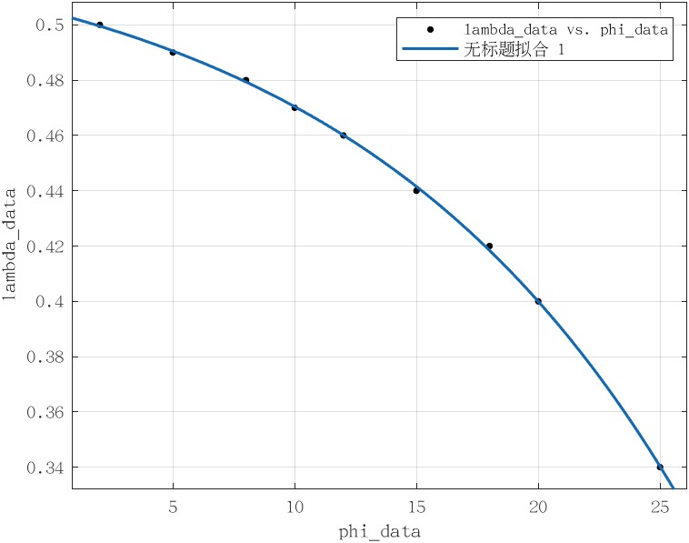

# 3次贝塞尔解析平滑转接

`作者：汤凯`

分支：dev_parking_bezier_smoothing

对应文件：  
  modules/planning/parking/common/bezier_local_smoother.h  
  modules/planning/parking/common/bezier_local_smoother.cpp 

**注：相关功能在search_based_planner与arc_based_planner中做了测试，可查看对应位置代码。**

**参考文献：**  
1. Walton, D. J., D. S. Meek, and J. M. Ali. "Planar G2 transition curves composed of cubic Bézier spiral segments." Journal of Computational and Applied Mathematics 157.2 (2003): 453-476.
2. Habib, Zulfiqar, and Manabu Sakai. "Fairing an arc spline and designing with G 2 PH quintic spiral transitions." International Journal of Computer Mathematics 90.5 (2013): 1023-1039.
3. Yang, Kwangjin, and Salah Sukkarieh. "An analytical continuous-curvature path-smoothing algorithm." IEEE Transactions on Robotics 26.3 (2010): 561-568.
---

## 1.方案简要说明

可使用的转接情形：  

case 1:  

case 2:  

  
- 定义 $\lambda=g/h$
- 圆弧端曲率：$\kappa=\frac{2h\sin(\phi)}{3k^2}$
- $k=d\sin(\phi)+R\tan(\phi/2)$

按照以上文献中螺线的构造方法没法满足case 1的需要（曲率超限较大，无法再曲率单调），本人采用以下参数构造方法：

- 通过优化方法找到不同 $\phi$ 下最优的（曲率超限百分比最小） $\lambda$ ，做函数拟合，拟合结果：$-0.03205 \exp(0.0725\phi) + 0.5366$
- 之后可通过单参数 $\phi$ 确定整条曲线

拟合结果：

设计参数与误差限关系：

最后只要将转接角 $\phi$ 设定在0~30度内即可（误差限最多1%左右）

## 2.函数模块说明

### （1）SmootherMathUtils：
功能函数与贝塞尔平滑转接采样函数接口

#### `SmootherMathUtils::BezierLocalSmootherSample`
- 贝塞尔平滑转接采样函数接口
- 输入：`PathSegments`，规划好的直线圆弧组合（目前只支持连续gear的单对直线-圆弧或圆弧-直线组合）
- 输出：`vector<PathPoint>`，经平滑后由弧长分辨率决定的均匀弧长点采样（包含曲率等信息）

#### `SmootherMathUtils::linspace`
- 与matlab中linspace函数一致

#### `SmootherMathUtils::SimpsonIntegrator`
- 辛普森积分器，用于构造完贝塞尔曲线后的弧长重参数化

### （2）BezierCurve2d：
2维贝塞尔曲线模块

#### `BezierCurve2d::Eval`
- 输入参数u(0~1)，输出对应的点

#### `BezierCurve2d::GetDiffOnceBezier`
- 返回对参数u求一阶导后的贝塞尔曲线类`BezierCurve2d`

#### `BezierCurve2d::EvalDerivative`
- 输入参数u(0~1)，输出对应的一阶导向量

#### `BezierCurve2d::GetTau`
- 输入参数u(0~1)，输出对应点的切向量

#### `BezierCurve2d::GetKappa`
- 输入参数u(0~1)，输出对应点的曲率（带符号）

#### `BezierCurve2d::SampleByIncrement`
- 给定弧长分辨率，按均匀弧长采样，返回三元组<points_samples, u_samples, s_samples>

#### `BezierCurve2d::reparam_samples_`静态成员
- 弧长重参数化积分时的采样数，默认100

### （3）CubicBezierLineArcSmoother
构造局部3次贝塞尔转接曲线的类

#### `CubicBezierLineArcSmoother::CubicBezierLineArcSmoother`构造函数
- 输入：
  - `pair<PathSegment ,PathSegment> line_arc_pair`，gear连续的直线-圆弧/圆弧-直线对
  - `bool isSingleTransOnArc`，圆弧是否只与单个直线做转接
  - `bool isSingleTransOnLine`，直线是否只与单个圆弧做转接
  - `init_guess_angle`，初设转接角（越大越好），默认25°，允许范围0~25°

#### `CubicBezierLineArcSmoother::GetLineOccupation`
- 计算转接贝塞尔在直线段上占用的长度

#### `CubicBezierLineArcSmoother::GetRemainSegments`
- 返回经贝塞尔转接后两边剩余的直线段与圆弧段pair（按照输入时的顺序）

#### `CubicBezierLineArcSmoother::SamplePathPoints`
- 返回贝塞尔转接曲线上的均匀弧长采样点（按分辨率`FLAGS_apa_output_trajectory_length_resolution`）

#### `CubicBezierLineArcSmoother::GetTransitionAngle`
- 返回转接角 $\phi$ (rad)

#### `CubicBezierLineArcSmoother::SetTransAngle`
- 输入：贝塞尔转接曲线可占用的最大直线段长度
- 输出：满足要求的最大转接角（按本方法，占用直线段长度在0~20度内递减，用二分法查找）

#### `CubicBezierLineArcSmoother::lookup_table_`静态成员
- 上文所说的最优参数表 $\phi-\lambda$

#### `CubicBezierLineArcSmoother::lookup_curve_`静态成员
- 由最优参数表拟合的最优参数查找曲线 $\phi-\lambda$