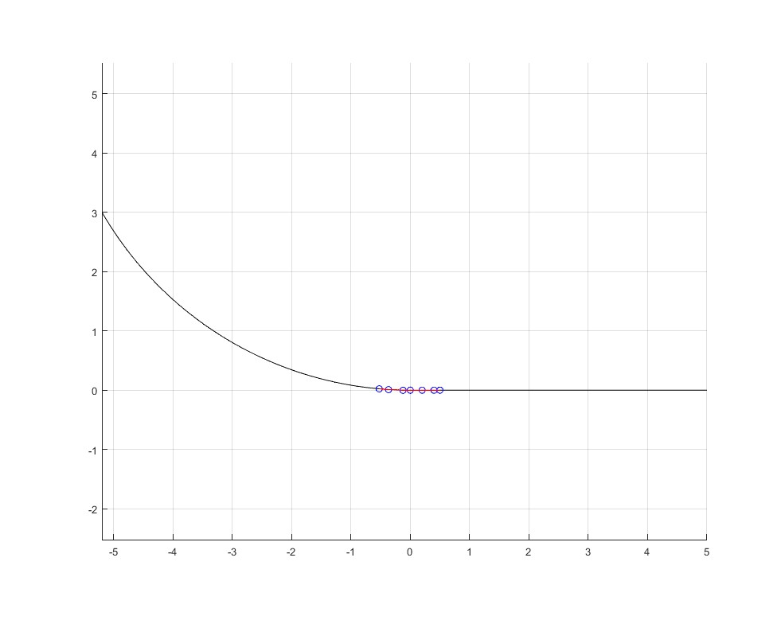
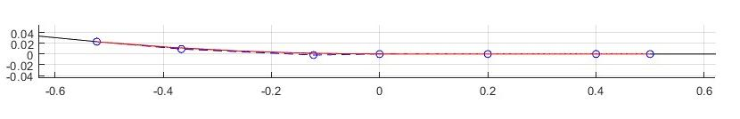
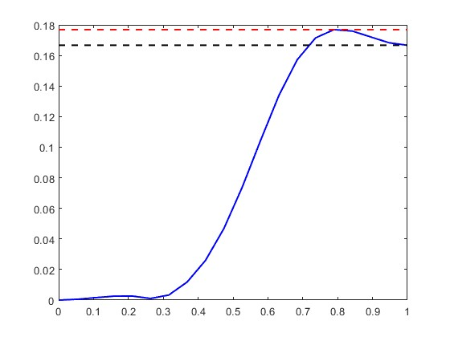

# Test result 1
**基于$C^3$连续5阶B样条的直线-圆弧转接方案：**  

设计参数：  
1. $l$: 直线$C^3$控制点，$||P_1P_2||=||P_2P_3||=l$, $||P_0P_1=0.5l||$ 
2. $\phi_e$: 直线到圆弧的转接角度
3. $c_1^o$: $||P_5P_6||$长度系数

---
## 测试案例：
参数：
- 圆弧半径（车最小转弯半径） $R=6m$
- $l = 0.2m$
- $\phi_e = 10$度
- $c_1^o = 0.2$

结果：  
（1）转接示意图：
  
  

（2）曲率随B样条参数变化图：  
  

分析：  
圆弧曲率 -- 0.167  
转接最大曲率 -- 0.177（超出%4.11）（对应转弯半径 5.76m）  
总转接端弧长 -- 1.02m

--- 
## 评估
方法优点：  
- 只需3个设计参数即可解析地确定一条C3连续转接曲线，便于跟踪控制，其3次连续的性质使其可以配合五次多项式参数化之类的跃度连续速度规划方法使用。  
- 曲率和曲率的一阶导数连续，意味着方向盘摆角和摆角变化都是连续的。

方法缺点：  
- 目前会存在曲率小幅超限的问题，难以严格满足曲率约束（可能放低要求用C2连续的曲线会改善这一情况）

