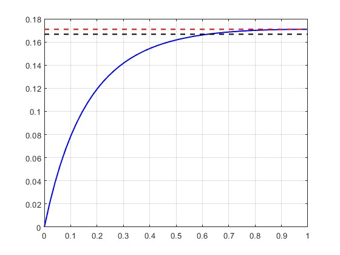

# Test result 2
**基于半$G^2$连续3阶贝塞尔螺线的直线-圆弧转接方案：**  

方案研究者：    
汤凯

设计参数：  
1. $\phi_e$: 直线到圆弧的转接角度

该方案的由来：  
- 本人基于文献 [Walton, Meek, and Ali, “Planar G2 Transition Curves Composed of Cubic Bézier Spiral Segments.”] 中提出的3阶贝塞尔螺线设计方案，在相切的直线圆弧场景下做了进一步的推导和验证，设计了一种可指定误差限的半G2连续转接方案。

该方案的特性：  
- 同时具有螺线性质和贝塞尔曲线性质，比羊角螺线更灵活。但由于螺线的性质，无法做到在相切的直线圆弧转接中两端同时保持$G^2$连续（不相交的情况才可以），其中直线端$G^2$连续，圆弧端$G^1$连续；
- 曲率是单调连续变化的；
- 可保证直线端是$G^2$连续的，而圆弧端可以通过给定的曲率相对误差限来确定直线到圆弧的转接角度 $\phi_e$ （最小可能达到的相对误差为 $\bar{\epsilon} = 1.78\%$，设定的相对误差需高于该值）；
- 圆弧端转接的曲率相对误差 $\bar{\epsilon}$ 随 $\phi_e$ 的增大而增大（非线性）。

---
## 测试案例：

直线-圆弧参数：
- 圆弧半径（车最小转弯半径） $R=6m$
- 直线长度5m

### 用例1：
- $\phi_e = 5$度

结果：  
（1）转接示意图：
  

（2）曲率随转接曲线参数变化图：  
  

日志：  
圆弧曲率 -- 0.167 (R = 6)   
转接最大曲率 -- 0.1700（超出 %1.97）  
总转接端弧长 -- 0.5788m  

### 用例2：
- $\phi_e = 10$度

结果：  
（1）转接示意图：
  

（2）曲率随转接曲线参数变化图：  
  

日志：  
圆弧曲率 -- 0.167 (R = 6)   
转接最大曲率 -- 0.1709（超出 %2.56）  
总转接端弧长 -- 1.1651m  

### 用例3：
- $\phi_e = 20$度

结果：  
（1）转接示意图：
  

（2）曲率随转接曲线参数变化图：  
  

日志：  
圆弧曲率 -- 0.167 (R = 6)   
转接最大曲率 -- 0.1751（超出 %5.04）  
总转接端弧长 -- 2.3933m  

### 用例4：
- $\phi_e = 30$度

结果：  
（1）转接示意图：
  

（2）曲率随转接曲线参数变化图：  
  

日志：  
圆弧曲率 -- 0.167 (R = 6)   
转接最大曲率 -- 0.1828（超出 %9.65）  
总转接端弧长 -- 3.7669m  

### 用例5：
- $\phi_e = 50$度

结果：  
（1）转接示意图：
  

（2）曲率随转接曲线参数变化图：  
  

日志：  
圆弧曲率 -- 0.167 (R = 6)   
转接最大曲率 -- 0.2168（超出 %30.06）  
总转接端弧长 -- 7.6148m  

--- 
## 评估
方法优点：  
- 可快速生成曲率单增且圆弧端曲率误差可控的半$G^2$连续转接曲线，并且易于工程实现

方法缺点：  
- 只有一个设计参数，自由度不高